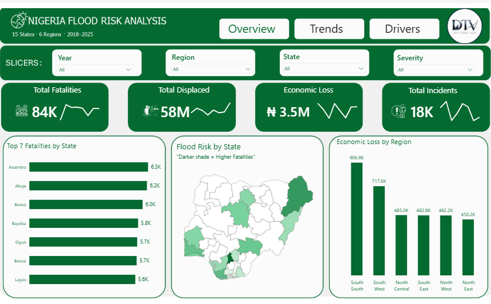
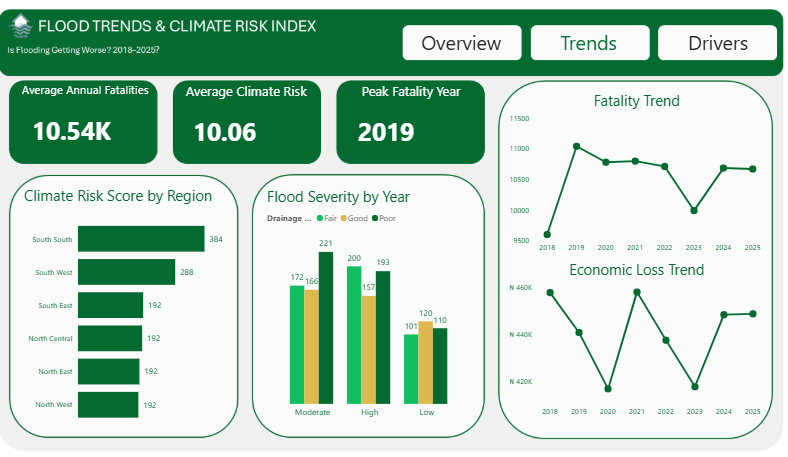
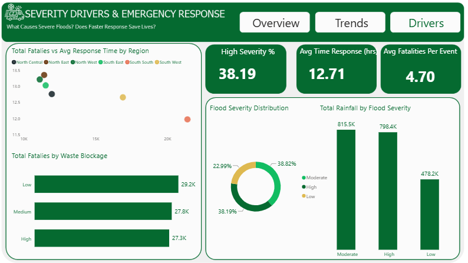

# Nigeria Flood Risk Analysis: SQL & Power BI Analysis (2018–2025)


## Overview

Flood-related disasters continue to affect communities across Nigeria through fatalities, population displacement and economic losses. Understanding where flood impacts are most severe can support better disaster preparedness, resource allocation and risk mitigation.

This project analyses flood incidents recorded between **2018 and 2025** across **15 Nigerian states** using SQL and Power BI. The analysis identifies flood trends, regional risk patterns and factors associated with severe flood events through an interactive dashboard.

---

## Live Dashboard

[Interactive Dashboard](  
https://app.powerbi.com/view?r=eyJrIjoiNTc2YWEzZWYtYmFhZS00OTcwLThmNDEtZjlkMjQwNTQ2ODgxIiwidCI6ImI5YmM1OTJjLWQ0MDMtNDJhMi1hNDIxLWY0ZmNkN2Q5MjljYyJ9)

---

## Business Questions

This project answers the following questions:

- Which states recorded the highest flood impact?
- Which regions experienced the greatest economic losses?
- How have flood incidents changed between 2018 and 2025?
- Which year recorded the highest flood fatalities?
- Which environmental factors are associated with severe flooding?
- Does emergency response time appear related to higher fatality levels?
- Which locations should be prioritised for flood mitigation?

---

## Analytics Workflow

### Data Preparation

The dataset was prepared in SQL by:

- Creating the database and table structure
- Assessing data quality
- Handling missing values
- Removing duplicate records
- Validating data consistency

### Exploratory Analysis

SQL queries were developed to analyse:

- Flood impact by state and region
- Annual flood trends
- Climate risk patterns
- Flood severity drivers
- Emergency response performance

### Data Transformation

The prepared dataset was imported into Power BI, where Power Query was used to perform additional transformations before building the analytical model.

### Business Analytics

DAX measures were created to calculate:

- Total Flood Incidents
- Total Fatalities
- Total Population Displaced
- Total Economic Loss
- Peak Fatality Year
- Average Climate Risk
- High Severity Rate
- Average Response Time
- Average Fatalities per Event

---

## Dashboard Walkthrough

### Executive Overview



Provides a national summary of flood activity through KPI cards, state comparisons, regional analysis and an interactive flood risk map.

---

### Trend Analysis



Examines flood trends between 2018 and 2025, highlighting changes in fatalities, economic losses, climate risk and flood severity.

---

### Severity Drivers & Emergency Response



Explores the relationship between flood severity, rainfall, waste blockage and emergency response performance.

---

## Key Findings

- **Anambra** recorded the highest flood fatalities (**6.3K**), followed by **Abuja (6.2K)** and **Borno (6.0K)**.
- **2019** recorded the highest average annual fatalities (**10.54K**), with fatality levels remaining consistently high throughout the study period.
- The **South South** region recorded both the highest economic loss (**₦906.9K**) and the highest climate risk score (**384**).
- **Moderate** and **High** severity floods accounted for over **77%** of recorded flood events.
- The average emergency response time was **12.71 hours**, while **38.19%** of recorded flood events were classified as high severity.

---

## Recommendations

- Prioritise flood mitigation initiatives in states with consistently high fatalities.
- Strengthen emergency response capacity across high-risk regions.
- Improve drainage infrastructure and waste management in flood-prone communities.
- Expand early warning systems to support disaster preparedness.
- Use regional risk indicators to guide resource allocation and mitigation planning.

---

## Project Limitations

- The analysis covers **15 Nigerian states** and does not represent all states in Nigeria.
- Findings depend on the completeness of the available dataset.
- The dataset was created for learning purposes and should not be interpreted as official government statistics.

---

## Tools

- **SQL:** Database management and querying
- **Power BI:** Data visualisation
- **Power Query:** Data transformation
- **DAX:** Business calculations
- **Microsoft Excel:** Data validation

---

## Repository Structure

```text
Nigeria-Flood-Risk-Intelligence/
│
├── Dashboard/
│   └── Nigeria_Flood_Risk_Intelligence_Dashboard.pbix
│
├── Data/
│   └── raw_flood_data.csv
│
├── Images/
│   ├── dashboard_preview.png
│   ├── executive_overview.png
│   ├── trend_analysis.png
│   └── severity_drivers.png
│
├── SQL/
│   ├── 01_database_setup.sql
│   ├── 02_data_cleaning.sql
│   └── 03_exploratory_analysis.sql
│
├── README.md
└── LICENSE
```

---

## Collaboration

This project was completed by **Team DTV**. Team members contributed throughout the project lifecycle, from planning and analysis to dashboard development and presentation. My primary contributions included SQL analysis, Power BI dashboard development and communicating the analytical findings.
